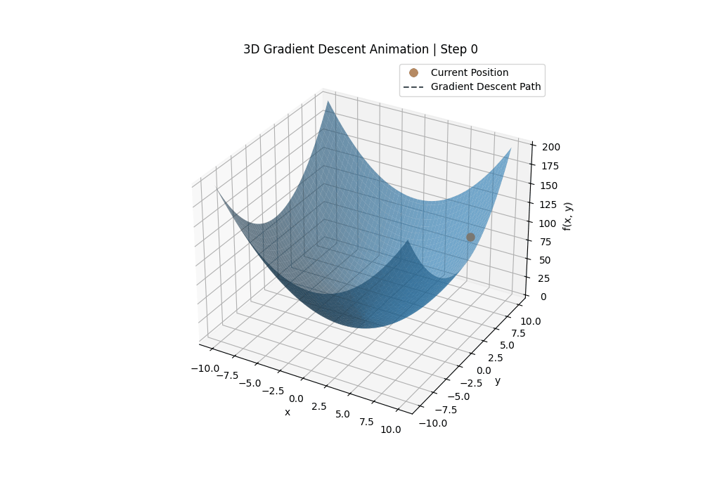

# Gradient Descent Visualization

This mini project demonstrates how **Gradient Descent** works using Python. It includes both 2D and 3D visualizations to show how an algorithm moves step by step toward the minimum value of a function.

Gradient Descent is one of the most important optimization techniques used in Machine Learning and Deep Learning. It helps models learn by reducing the error or loss over multiple iterations.

---

## Project Demo

### 3D Gradient Descent Animation

---

## What is Gradient Descent?

Gradient Descent is an optimization algorithm used to find the minimum value of a function.

In Machine Learning, we usually define a **loss function** that measures how far the model's predictions are from the actual values. Gradient Descent helps reduce this loss by updating the model parameters in the opposite direction of the gradient.

The basic update rule is:

    parameter = parameter - learning_rate × gradient

Where:

- **parameter** is the value we want to update
- **learning_rate** controls how big each step is
- **gradient** tells us the direction of the steepest increase
- We subtract the gradient because we want to move downhill toward the minimum

---

## Functions Used in This Project

### 2D Function

    f(x) = x²

The minimum value of this function is at:

    x = 0

### 3D Function

    f(x, y) = x² + y²

The minimum value of this function is at:

    x = 0, y = 0

This creates a bowl-shaped surface where Gradient Descent starts from a higher point and moves step by step toward the bottom.

---

## Project Features

- Explains the concept of Gradient Descent
- Implements Gradient Descent from scratch
- Shows step-by-step parameter updates
- Visualizes Gradient Descent in 2D
- Visualizes Gradient Descent in 3D
- Includes animated movement toward the minimum point
- Demonstrates the effect of learning rate and iterations

---

## Technologies Used

- Python
- NumPy
- Matplotlib
- Google Colab
- GitHub

---

## Folder Structure

    gradient-descent/
    │
    ├── Gradient_Descent.ipynb
    ├── gradient_descent_3d.gif
    └── README.md

---

## How to Run This Project

### Option 1: Run in Google Colab

1. Open the notebook file:

       Gradient_Descent.ipynb

2. Run each cell from top to bottom.

3. View the 2D plot, 3D surface, and animation output.

### Option 2: Run Locally

Clone the repository:

    git clone https://github.com/RamanandaSindhu/AI_projects.git

Move into the project folder:

    cd AI_projects/gradient-descent

Install the required libraries:

    pip install numpy matplotlib notebook

Start Jupyter Notebook:

    jupyter notebook

Open `Gradient_Descent.ipynb` and run all cells.

---

## Key Learning Outcomes

After completing this project, you will understand:

- What Gradient Descent is
- Why it is used in Machine Learning
- How gradients help find the minimum value
- How learning rate affects optimization
- How Gradient Descent updates values step by step
- How to visualize optimization in 2D and 3D

---

## Example Gradient Descent Update

For the function:

    f(x, y) = x² + y²

The gradients are:

    df/dx = 2x
    df/dy = 2y

The update steps are:

    x = x - learning_rate × 2x
    y = y - learning_rate × 2y

With every iteration, the values of `x` and `y` move closer to `0`, which is the minimum point.

---

## Sample Output

During training, the output shows how the values change over each iteration:

    Iteration 1: x = 6.4000, y = 4.8000, z = 64.0000
    Iteration 2: x = 5.1200, y = 3.8400, z = 40.9600
    Iteration 3: x = 4.0960, y = 3.0720, z = 26.2144
    ...
    Iteration 40: x = 0.0011, y = 0.0008, z = 0.0000

This shows that the algorithm is successfully moving toward the minimum value.

---

## Why This Project is Useful

This project is useful for beginners who want to understand how Machine Learning models learn internally. Instead of only reading the formula, this project visually shows how the algorithm moves closer to the best solution step by step.

Gradient Descent is used in many Machine Learning models, including:

- Linear Regression
- Logistic Regression
- Neural Networks
- Deep Learning models

---

## Future Improvements

Possible improvements for this project:

- Add comparison between different learning rates
- Add visualization for too small and too large learning rates
- Add Linear Regression using Gradient Descent
- Add interactive sliders for learning rate and starting point
- Add more complex cost functions

---

## Author

Created as part of my Machine Learning mini projects.
